## 실시간 온라인 수업 플랫폼_Real Time Online Class Platform 

 

 

## 📑 프로젝트 개요
COVID-19로 수업 방식이 오프라인에서 온라인으로 변화함에따라 온라인 플랫폼의 사용 빈도가 증가하였다. 이에 효율적인 온라인 수업을 진행할 수 있는 플랫폼을 구현하였다.

본 프로젝트의 목표는 캘린터를 통해 온라인 수업(화상 강의)를 예약 및 조회할 수 있는 플랫폼을 구현하는 것이다.

 

## 📋 시스템구성 및 기능
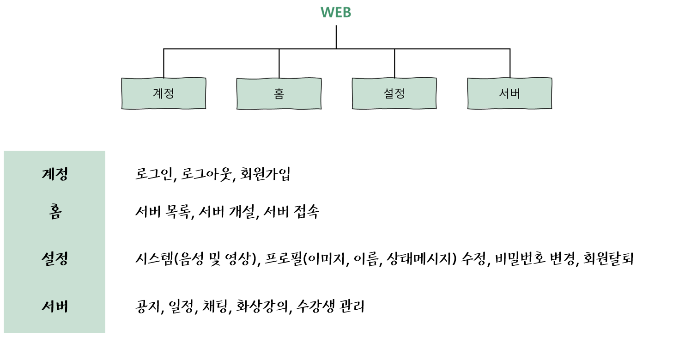

 

## 💻 프로젝트 구현

### [ 계정 ]
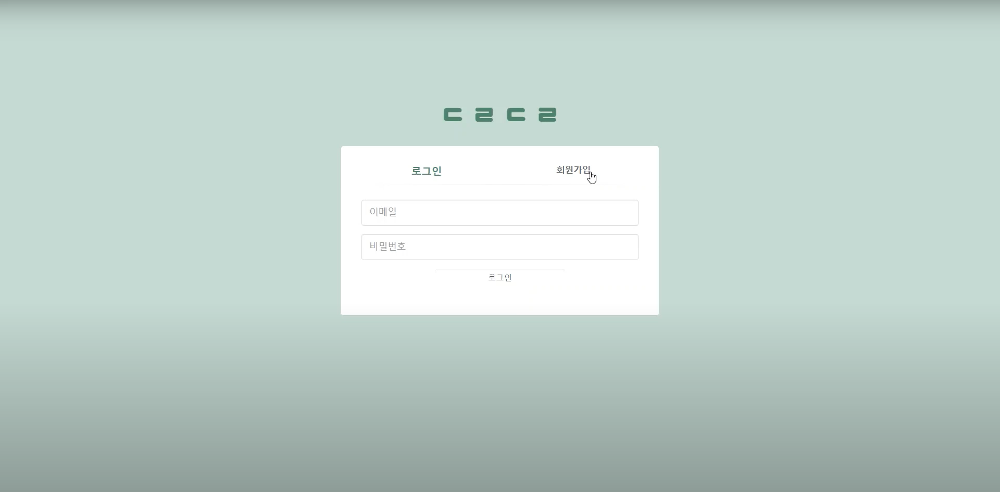
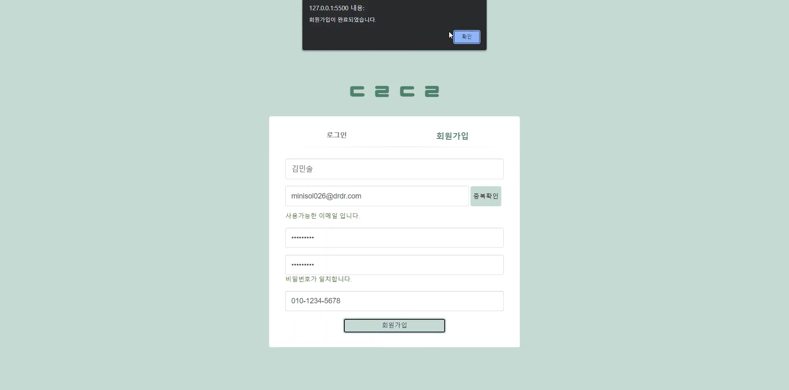
 

### [ 홈 ]
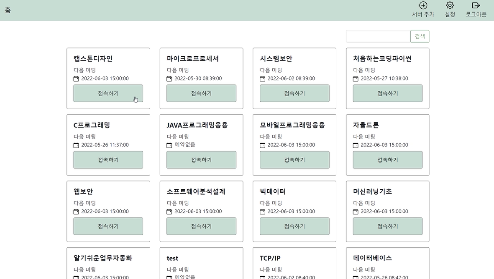
 

### [ 설정 ]
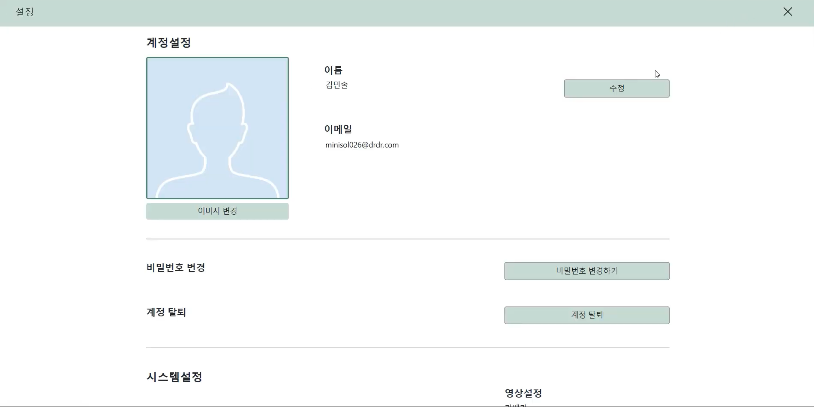
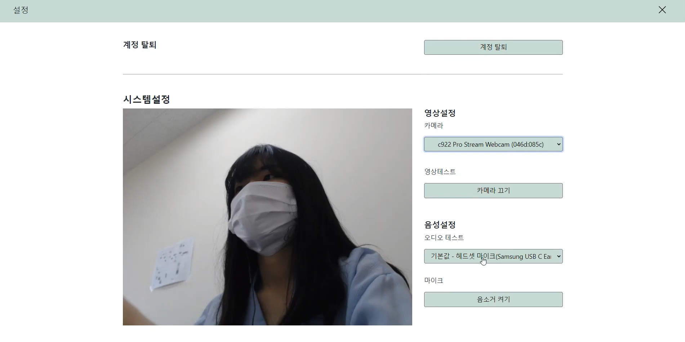
 

### [ 서버 ]
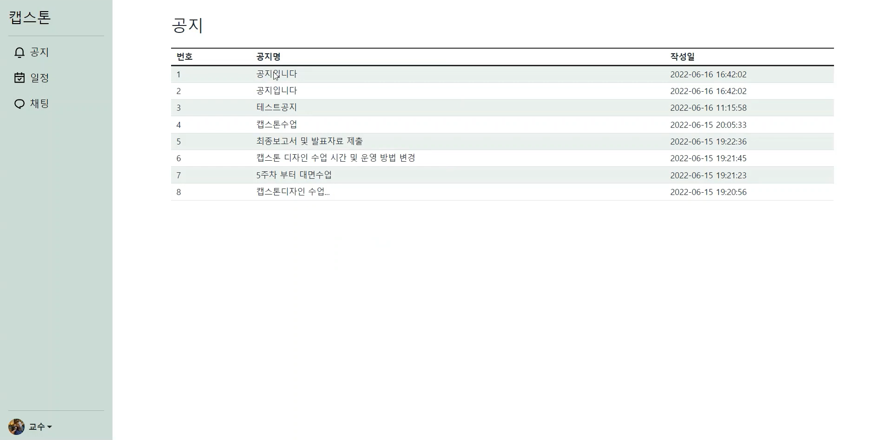
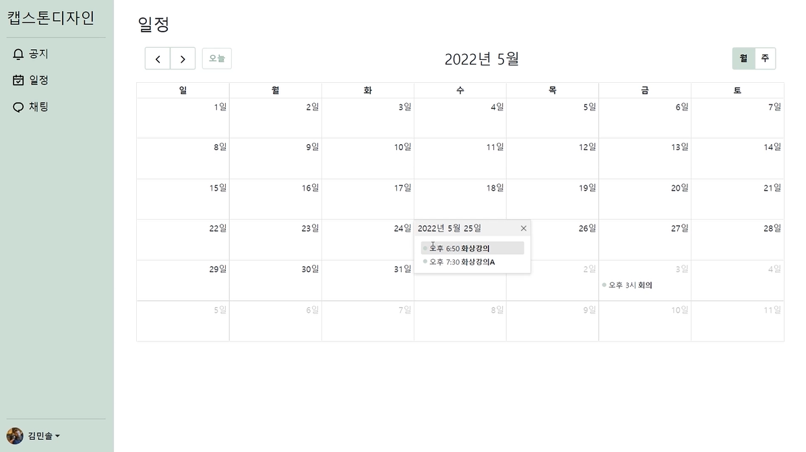
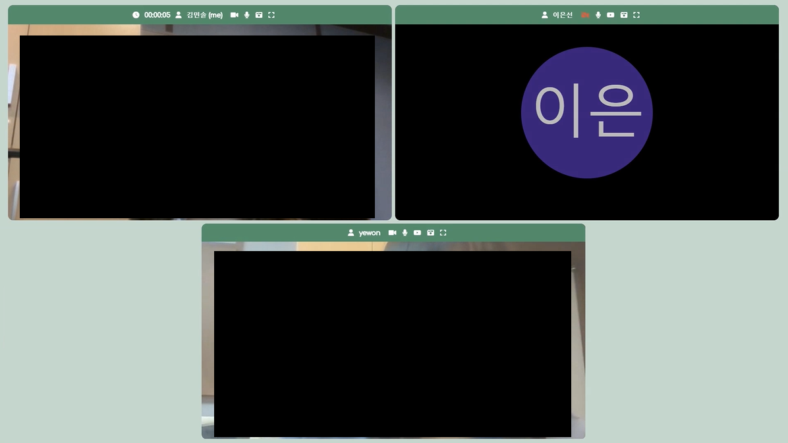
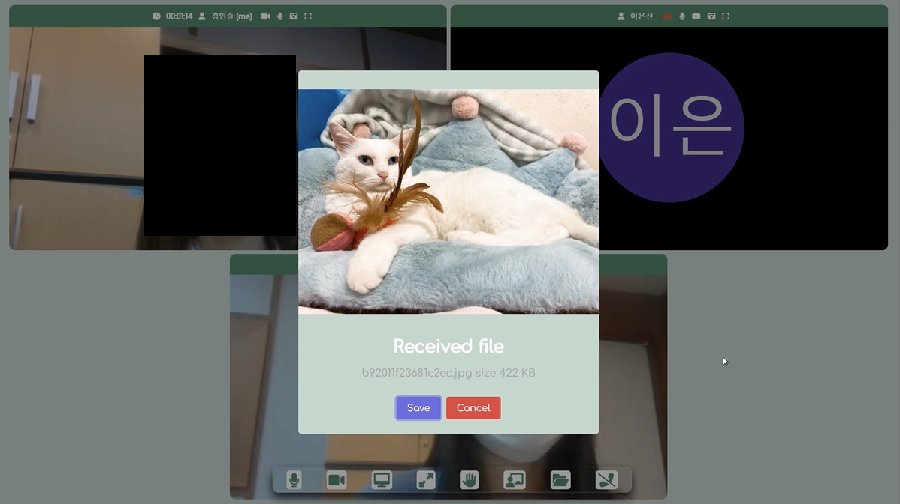
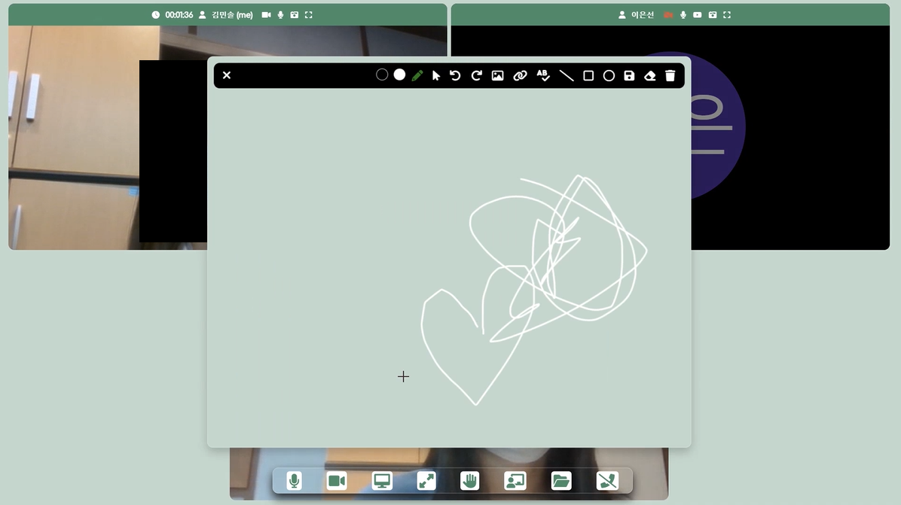
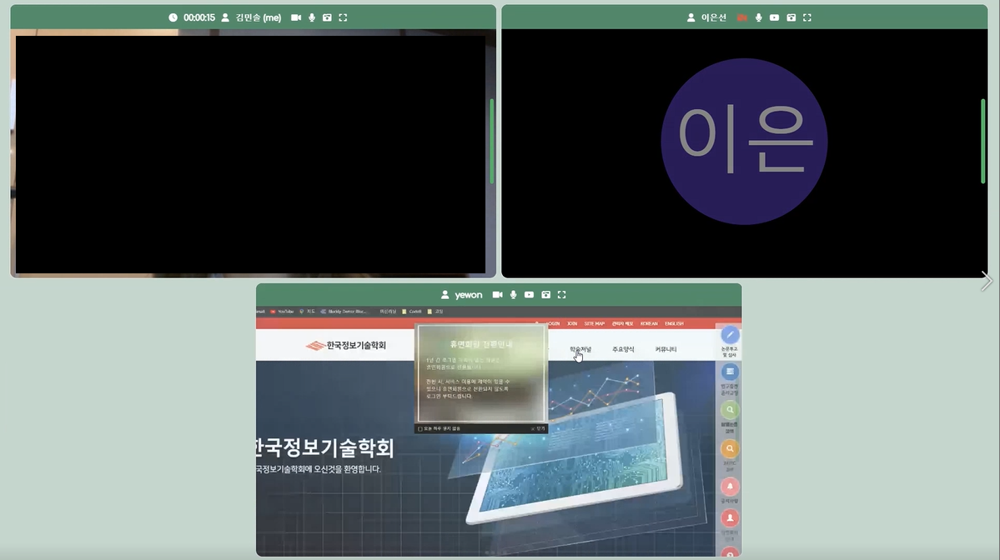
